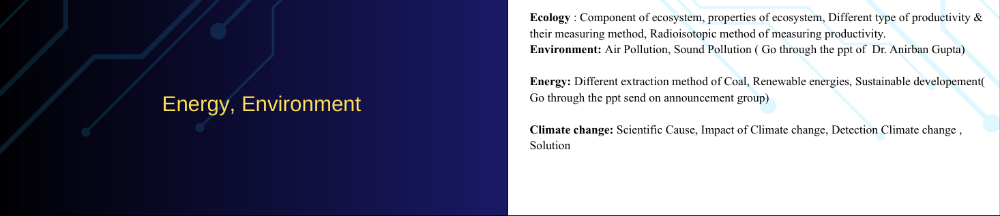

# 🎓 Ecology Exam Prep App (CE1201N)

A lightweight, interactive study application designed for last-minute revision of Ecology and Environmental Engineering concepts for the CE1201N course at IIEST Shibpur.

This project consolidates Past Year Questions (PYQs) from 2021 to 2025, providing concise, exam-ready answers, formulas, and structural breakdown of key concepts across four main modules: Ecology, Environment, Energy, and Climate Change.

 *(Preview placeholder)*

## ✨ Features

- **Topic Modules:** Filter questions by modules:
  - 🌿 Ecology
  - 🏭 Environment (Air/Noise pollution, AQI, SO₂)
  - ⚡ Energy (Renewable, Non-renewable, Goals)
  - 🌡️ Climate Change (GHGs, Global Warming, Carbon Footprint)
- **Detailed & Quick Notes Modes:** Toggle between detailed, descriptive answers (better for 5-7 marks) and quick key points (better for quick recall).
- **Progress Tracking:** Mark questions as "done" and watch your progress bar fill up. (Saves locally directly in your browser).
- **Dark/Light Theme:** A visually pleasing toggle for late-night studying.
- **Priority Tracking:** Questions are color-coded by priority (P0: Must Know -> P3: Bonus) based on exam trends.

## 🚀 Getting Started

Since this is a single, zero-dependency HTML file, there is no build process or backend required!

1. Clone or download the repository.
2. Open `index.html` in any modern web browser (Chrome, Edge, Firefox, Safari).
3. Start studying!

## 📁 Repository Structure

\`\`\`text
.
├── index.html          # Core application (UI + Data + Logic)
├── README.md           # Project documentation
└── resources/          # Raw study materials and course contents
    ├── content/        # PPTs, PDFs, and notes for all modules
    ├── Numericals/     # Screenshot solutions for numerical problems
    ├── PYQs/           # Previous Year Question papers (2021-2025)
    ├── syllabus.txt    # Text copy of syllabus topics
    └── syllabus.png    # Image of the syllabus
\`\`\`

## 🛠️ Built With

- **HTML5 & CSS3:** For structure and styling. Contains custom variables and light/dark theme implementations.
- **Vanilla JavaScript (ES6):** Used for rendering the questions natively and handling localStorage for progress tracking.

---

> *Vibe-coded for the CE1201N exam.*
